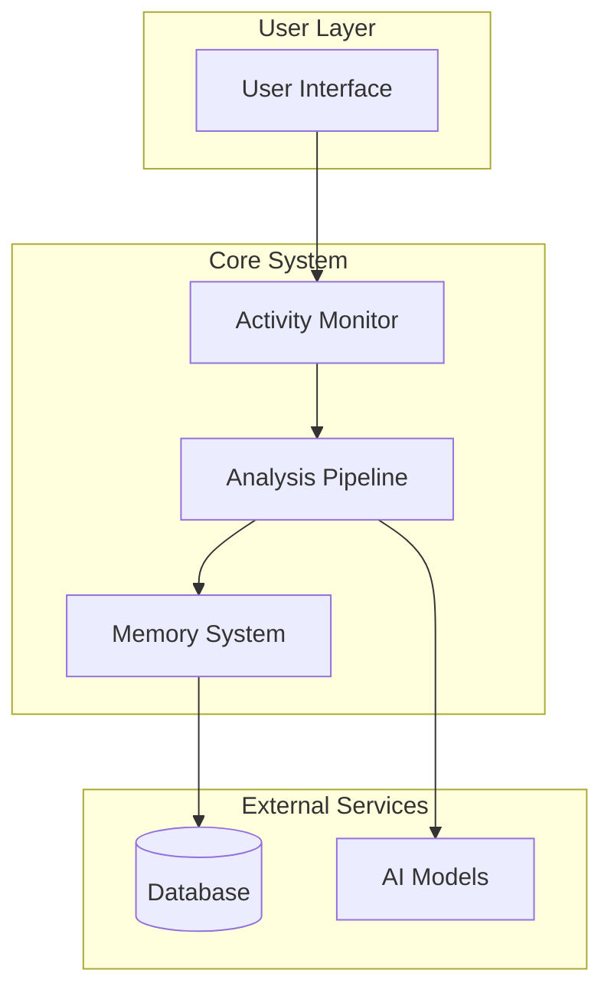
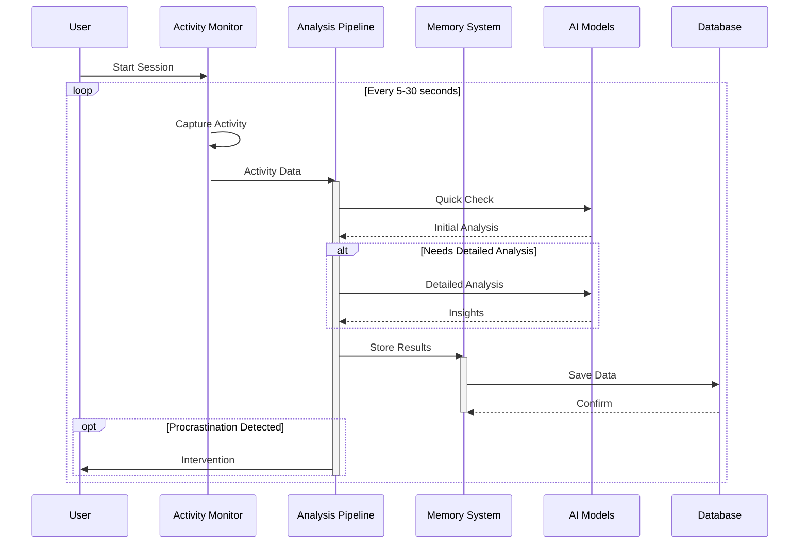
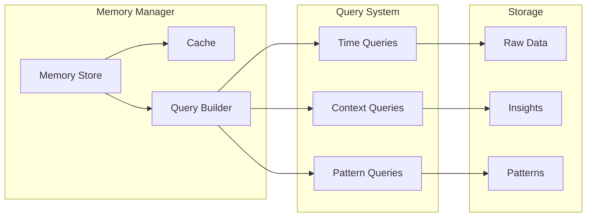
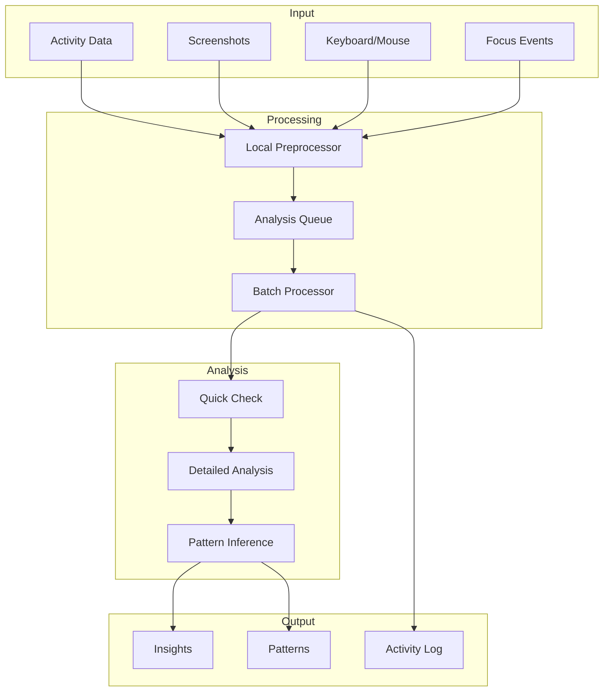
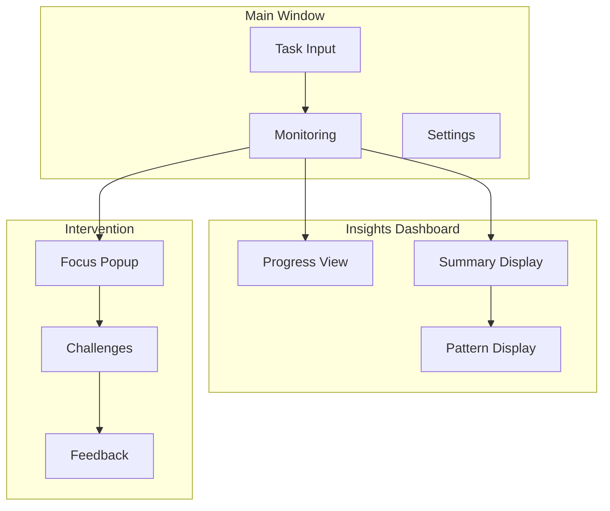
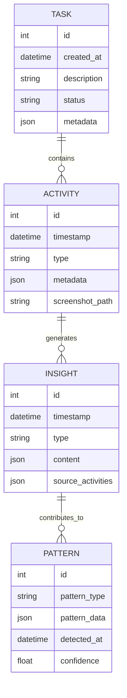
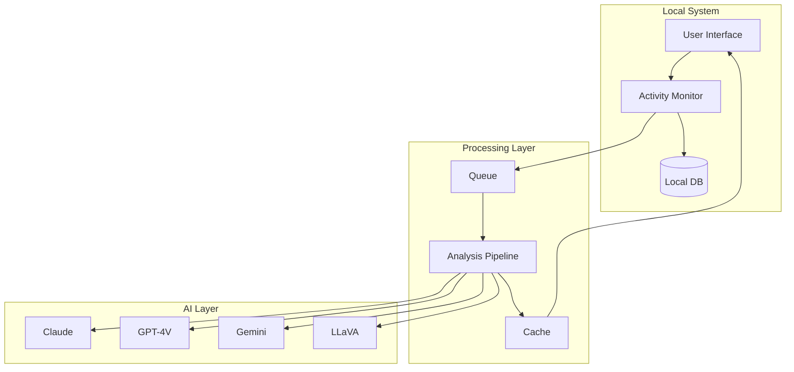

# Architecture Diagrams

## System Overview

```mermaid
graph TB
    UI[User Interface]
    AM[Activity Monitor]
    AP[Analysis Pipeline]
    MS[Memory System]
    DB[(Database)]
    AI[AI Models]
    
    UI --> AM
    AM --> AP
    AP --> AI
    AP --> MS
    MS --> DB
    
    subgraph User Layer
        UI
    end
    
    subgraph Core System
        AM
        AP
        MS
    end
    
    subgraph External Services
        AI
        DB
    end
```

## Data Flow

```mermaid
sequenceDiagram
    participant U as User
    participant AM as Activity Monitor
    participant AP as Analysis Pipeline
    participant MS as Memory System
    participant AI as AI Models
    participant DB as Database

    U->>AM: Start Session
    activate AM
    
    loop Every 5-30 seconds
        AM->>AM: Capture Activity
        AM->>AP: Activity Data
        activate AP
        
        AP->>AI: Quick Check
        AI-->>AP: Initial Analysis
        
        alt Needs Detailed Analysis
            AP->>AI: Detailed Analysis
            AI-->>AP: Insights
        end
        
        AP->>MS: Store Results
        activate MS
        MS->>DB: Save Data
        DB-->>MS: Confirm
        deactivate MS
        
        opt Procrastination Detected
            AP->>U: Intervention
        end
        
        deactivate AP
    end
```

## Memory System Architecture

```mermaid
graph LR
    subgraph Memory Manager
        MS[Memory Store]
        C[Cache]
        QB[Query Builder]
    end
    
    subgraph Storage
        RAW[Raw Data]
        INS[Insights]
        PAT[Patterns]
    end
    
    subgraph Query System
        TQ[Time Queries]
        CQ[Context Queries]
        PQ[Pattern Queries]
    end
    
    MS --> C
    MS --> QB
    QB --> TQ
    QB --> CQ
    QB --> PQ
    
    TQ --> RAW
    CQ --> INS
    PQ --> PAT
```

## Analysis Pipeline

```mermaid
graph TD
    subgraph Input
        A[Activity Data]
        S[Screenshots]
        K[Keyboard/Mouse]
        F[Focus Events]
    end
    
    subgraph Processing
        Q[Analysis Queue]
        LP[Local Preprocessor]
        BP[Batch Processor]
    end
    
    subgraph Analysis
        QC[Quick Check]
        DA[Detailed Analysis]
        PI[Pattern Inference]
    end
    
    subgraph Output
        I[Insights]
        P[Patterns]
        AL[Activity Log]
    end
    
    A --> LP
    S --> LP
    K --> LP
    F --> LP
    
    LP --> Q
    Q --> BP
    
    BP --> QC
    QC --> DA
    DA --> PI
    
    PI --> I
    PI --> P
    BP --> AL
```

## UI Components

```mermaid
graph TD
    subgraph Main Window
        TI[Task Input]
        M[Monitoring]
        S[Settings]
    end
    
    subgraph Insights Dashboard
        PV[Progress View]
        SD[Summary Display]
        PD[Pattern Display]
    end
    
    subgraph Intervention
        FP[Focus Popup]
        CH[Challenges]
        FB[Feedback]
    end
    
    TI --> M
    M --> PV
    M --> SD
    
    SD --> PD
    M --> FP
    FP --> CH
    CH --> FB
```

## Data Model

```mermaid
erDiagram
    ACTIVITY {
        int id
        datetime timestamp
        string type
        json metadata
        string screenshot_path
    }
    
    INSIGHT {
        int id
        datetime timestamp
        string type
        json content
        json source_activities
    }
    
    TASK {
        int id
        datetime created_at
        string description
        string status
        json metadata
    }
    
    PATTERN {
        int id
        string pattern_type
        json pattern_data
        datetime detected_at
        float confidence
    }
    
    ACTIVITY ||--o{ INSIGHT : generates
    INSIGHT ||--o{ PATTERN : contributes_to
    TASK ||--o{ ACTIVITY : contains
```

## Deployment Architecture

```mermaid
graph TB
    subgraph Local System
        UI[User Interface]
        AM[Activity Monitor]
        LDB[(Local DB)]
    end
    
    subgraph Processing Layer
        Q[Queue]
        AP[Analysis Pipeline]
        C[Cache]
    end
    
    subgraph AI Layer
        CL[Claude]
        GPT[GPT-4V]
        GM[Gemini]
        LL[LLaVA]
    end
    
    UI --> AM
    AM --> LDB
    AM --> Q
    Q --> AP
    AP --> C
    
    AP --> CL
    AP --> GPT
    AP --> GM
    AP --> LL
    
    C --> UI
``` 